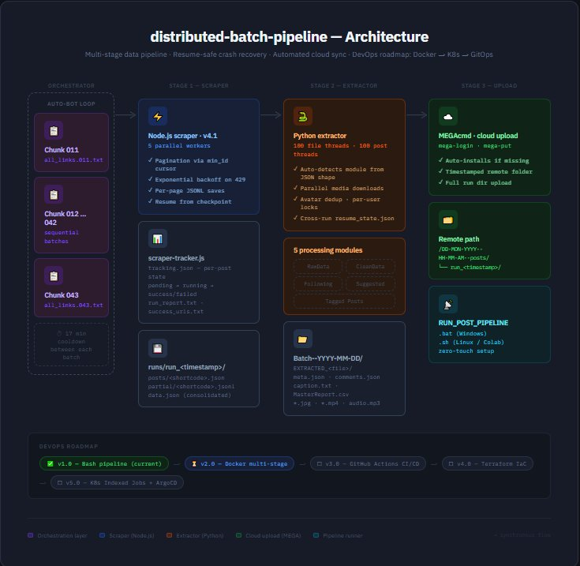

# 📡 InstaHarvest Pipeline

> **Enterprise-grade Instagram data extraction pipeline** with parallel processing, resume support, automated cloud upload, and a DevOps-first architecture. Built to demonstrate production-level engineering practices — from local execution to full container orchestration.
## Architecture


---

## 🗂️ Table of Contents

- [Overview](#overview)
- [Architecture](#architecture)
- [Project Structure](#project-structure)
- [Features](#features)
- [Tech Stack](#tech-stack)
- [Quick Start](#quick-start)
  - [Prerequisites](#prerequisites)
  - [Windows](#windows)
  - [Linux / macOS](#linux--macos)
- [Configuration](#configuration)
  - [Credentials Setup](#credentials-setup)
  - [Scraper Settings](#scraper-settings)
  - [Extractor Settings](#extractor-settings)
- [Pipeline Deep Dive](#pipeline-deep-dive)
  - [Stage 1 — Link Ingestion](#stage-1--link-ingestion)
  - [Stage 2 — Comment Scraping (v4.1)](#stage-2--comment-scraping-v41)
  - [Stage 3 — Data Extraction](#stage-3--data-extraction)
  - [Stage 4 — Cloud Upload (MEGA)](#stage-4--cloud-upload-mega)
  - [Auto-Bot Orchestration](#auto-bot-orchestration)
- [Module Reference](#module-reference)
- [Resume & Fault Tolerance](#resume--fault-tolerance)
- [Output Structure](#output-structure)
- [Tracking & Observability](#tracking--observability)
- [Roadmap — DevOps Evolution](#roadmap--devops-evolution)
- [Contributing](#contributing)
- [License](#license)

---

## Overview

**InstaHarvest Pipeline** is a multi-stage, production-hardened data pipeline for extracting Instagram post metadata, comments, media, and profile data at scale. The project is designed as a progressive DevOps showcase — starting from a robust local CLI pipeline and evolving toward a fully containerized, Kubernetes-orchestrated, GitOps-managed data platform.

**Current Version:** `v1.0` — Local execution, full automation, cloud sync  
**Target Version:** `v3.0` — Docker → ArgoCD → Kubernetes (see [Roadmap](#roadmap--devops-evolution))

### What it does

- Accepts a list of Instagram post URLs (`links.txt`)
- Scrapes all comments with pagination, retry logic, and rate-limit handling
- Extracts structured data: captions, metrics, media files, profile info, tagged users, location, audio metadata
- Organizes everything into timestamped batch folders
- Uploads the full dataset to MEGA cloud storage automatically
- Supports chunked batch processing via `AUTO_BOT` for large-scale runs (1000s of links)

---

## Architecture

```
┌─────────────────────────────────────────────────────────────────┐
│                        InstaHarvest Pipeline                    │
│                                                                 │
│  links.txt                                                      │
│      │                                                          │
│      ▼                                                          │
│  ┌─────────┐    ┌──────────────┐    ┌────────────────────┐     │
│  │  v4.1.js │───▶│  runs/run_* │───▶│  extraction.py     │     │
│  │ (Scraper)│    │  (Raw JSON) │    │  (5 Modules)       │     │
│  └─────────┘    └──────────────┘    └────────────────────┘     │
│   • N workers                         • RawData                 │
│   • Resume state                      • CleanData               │
│   • Rate limiting                     • Following               │
│   • Partial saves                     • Suggested               │
│                                       • Tagged Posts            │
│                                              │                  │
│                                              ▼                  │
│                                    ┌──────────────────┐        │
│                                    │  MEGA Cloud      │        │
│                                    │  Upload          │        │
│                                    │  (timestamped)   │        │
│                                    └──────────────────┘        │
│                                                                 │
│  AUTO_BOT → Iterates over chunked link files (011–043)         │
│             17-min cooldown between batches                     │
└─────────────────────────────────────────────────────────────────┘
```

---

## Project Structure

```
instaharvest-pipeline/
│
├── links.txt                              # Input: one Instagram post URL per line
│
├── v4.1.js                                # Core scraper — comment fetcher with worker pool
├── scraper-tracker.js                     # Tracking system — per-post state & run reports
├── extraction.py                          # Data extractor — 5-module parallel processor
│
├── RUN_POST_PIPELINE.bat                  # Full pipeline runner (Windows)
├── RUN_POST_PIPELINE.sh                   # Full pipeline runner (Linux/macOS)
│
├── AUTO_BOT.bat                           # Batch orchestrator — Windows (chunks 011–043)
├── AUTO_BOT.sh                            # Batch orchestrator — Linux/macOS
│
├── splitting/                             # Chunked link files for large-scale runs
│   ├── all_links.011.txt
│   ├── all_links.012.txt
│   └── ...
│
├── runs/                                  # Scraper output (auto-created)
│   └── run_<timestamp>/
│       ├── tracking.json                  # Live run state
│       ├── run_report.txt                 # Human-readable summary
│       ├── success_urls.txt
│       ├── failed_urls.txt
│       ├── incomplete_urls.txt
│       ├── data.json                      # Consolidated raw output
│       ├── posts/
│       │   └── <shortcode>.json
│       └── partial/                       # Resume checkpoints
│           └── <shortcode>.jsonl
│
└── resume_state.json                      # Extractor resume state (cross-run)
```

---

## Features

### Scraper (`v4.1.js`)
- ✅ **Multi-worker parallel scraping** — configurable worker count
- ✅ **Intelligent resume** — detects existing runs, skips completed posts
- ✅ **Incremental partial saves** — every page saved to `.jsonl` mid-run
- ✅ **Global rate limiter** — exponential backoff on 429, all workers pause/resume together
- ✅ **Retry logic** — up to 4 retries with progressive wait
- ✅ **Optional reply fetching** — configurable concurrency for nested replies
- ✅ **Comment limit cap** — stop after N comments per post
- ✅ **Live ETA & coverage stats** — per-post and aggregate

### Extractor (`extraction.py`)
- ✅ **5 processing modules** — auto-detected from file structure
- ✅ **100-thread parallel processing** — files and posts processed concurrently
- ✅ **Parallel media downloads** — multiple media URLs per post downloaded simultaneously
- ✅ **Avatar deduplication** — per-user locks prevent race conditions
- ✅ **Enterprise metrics extraction** — likes, views, plays, comments, location, accessibility caption
- ✅ **Audio metadata extraction** — original sound, music attribution, download URL
- ✅ **Tagged user extraction** — with coordinates (X/Y position on image)
- ✅ **CSV reports** — master report, location report, tagged users report per post
- ✅ **Cross-run resume state** — `resume_state.json` survives restarts
- ✅ **Auto-organizer** — moves loose JSON files into `datasets/` automatically

### Pipeline (`RUN_POST_PIPELINE`)
- ✅ **Zero-touch setup** — installs Node.js, axios, MEGAcmd if missing
- ✅ **Timestamped MEGA uploads** — format: `DD-MON-YYYY--HH-MM-AM/PM--posts`
- ✅ **Cross-platform** — `.bat` for Windows, `.sh` for Linux/macOS/Colab
- ✅ **Latest run auto-detection** — finds the newest `run_*` folder automatically

### AUTO_BOT
- ✅ **Chunked batch processing** — iterates through pre-split link files sequentially
- ✅ **Configurable cooldown** — 17-minute sleep between batches (account safety)
- ✅ **Skip-on-missing** — warns and continues if a chunk file is absent
- ✅ **Cross-platform** — `.bat` + `.sh`

---

## Tech Stack

| Layer | Technology |
|---|---|
| **Scraper** | Node.js, Axios, Instagram Private API |
| **Extractor** | Python 3, `requests`, `concurrent.futures`, `threading` |
| **Orchestration** | Bash / Windows Batch |
| **Cloud Storage** | MEGA via MEGAcmd CLI |
| **Tracking** | JSON state files, plain-text reports, CSV |
| **Planned — v2** | Docker, Docker Compose |
| **Planned — v3** | Kubernetes, ArgoCD, Helm |

---

## Quick Start

### Prerequisites

| Tool | Minimum Version | Notes |
|---|---|---|
| Node.js | v18+ | Auto-installed by pipeline if missing |
| Python | 3.8+ | Must be installed manually |
| pip package: `requests` | Any | Auto-installed by pipeline |
| MEGAcmd | Latest | Auto-installed by pipeline |
| MEGA account | — | Free account works |

---

### Windows

**1. Clone the repo**
```bat
git clone https://github.com/yourusername/instaharvest-pipeline.git
cd instaharvest-pipeline
```

**2. Add your Instagram post URLs to `links.txt`**
```
https://www.instagram.com/p/ABC123/
https://www.instagram.com/p/XYZ789/
```

**3. Set your credentials** — see [Configuration](#configuration)

**4. Run the full pipeline**
```bat
RUN_POST_PIPELINE.bat
```

**5. For large-scale runs (1000+ links), use AUTO_BOT**
```bat
AUTO_BOT.bat
```

---

### Linux / macOS

```bash
git clone https://github.com/yourusername/instaharvest-pipeline.git
cd instaharvest-pipeline

# Add URLs
nano links.txt

# Make scripts executable
chmod +x RUN_POST_PIPELINE.sh AUTO_BOT.sh

# Run pipeline
./RUN_POST_PIPELINE.sh

# Or for batch runs
./AUTO_BOT.sh
```

---

## Configuration

### Credentials Setup

**In `v4.1.js`** — replace the cookie array with your own Instagram session cookies:

```js
const rawCookiesJson = [
    { "name": "sessionid",  "value": "YOUR_SESSION_ID" },
    { "name": "csrftoken",  "value": "YOUR_CSRF_TOKEN" },
    { "name": "ds_user_id", "value": "YOUR_USER_ID" },
    { "name": "datr",       "value": "YOUR_DATR_VALUE" },
    // ... other cookies
];
```

> **How to get cookies:** Open Instagram in Chrome → DevTools → Application → Cookies → `www.instagram.com` → copy values.

**In `RUN_POST_PIPELINE.bat` / `.sh`** — set your MEGA credentials:

```bat
set MEGA_EMAIL=your@email.com
set MEGA_PASSWORD=yourpassword
set MEGA_REMOTE_BASE=/
```

---

### Scraper Settings

All in `v4.1.js` under the `SETTINGS` object:

```js
const SETTINGS = {
    WORKER_COUNT:          5,      // Parallel workers (increase for speed, risk rate-limit)
    MAX_COMMENTS_PER_POST: 0,      // 0 = unlimited; set e.g. 500 to cap per post
    FETCH_REPLIES:         false,  // true = fetch nested replies (slower, more data)
    REPLY_CONCURRENCY:     3,      // How many reply threads to fetch in parallel
    PAGE_DELAY_MS:         1200,   // Delay between comment pages (ms) — lower = faster but riskier
    POST_DELAY_MS:         2500,   // Delay between posts (ms)
};
```

---

### Extractor Settings

All in `extraction.py` under the configuration block:

```python
PARALLEL_FILES  = 100    # How many JSON files to process simultaneously
PARALLEL_POSTS  = 100    # Threads per file for post processing
PARALLEL_MEDIA  = True   # Parallel media URL downloads within a post
DOWNLOAD_MEDIA  = True   # Set False to skip all media downloads (metadata only)
ITEM_LIMIT      = 5000000000  # Max posts to process per file (effectively unlimited)
MAX_PFP_PER_RUN = 99999999   # Max profile pictures to download
```

---

### Chunk Configuration (AUTO_BOT)

Edit the loop range in `AUTO_BOT.bat` / `AUTO_BOT.sh`:

```bat
:: Windows — process chunks 011 to 043
for /L %%i in (11, 1, 43) do (
```

```bash
# Linux — process chunks 011 to 043
for i in {011..043}
```

Place chunk files in the `splitting/` folder named as `all_links.011.txt`, `all_links.012.txt`, etc.

**To split a large links file into chunks:**
```bash
split -l 50 all_links.txt splitting/all_links. --numeric-suffixes=11 --suffix-length=3 --additional-suffix=.txt
```

---

## Pipeline Deep Dive

### Stage 1 — Link Ingestion

`links.txt` is the pipeline's entry point. Each line is one Instagram URL. The scraper supports multiple URL formats:

```
https://www.instagram.com/p/ABC123/
https://www.instagram.com/reels/ABC123/
https://www.instagram.com/tv/ABC123/
ABC123                                    # Bare shortcode also accepted
```

Duplicates are automatically deduplicated by shortcode before processing begins.

---

### Stage 2 — Comment Scraping (`v4.1.js`)

The scraper uses Instagram's private GraphQL API and REST comment endpoints.

**Flow per post:**
1. Fetch post metadata via GraphQL (`doc_id=8845758582119845`)
2. Extract `mediaId` and total comment count from response
3. Paginate through `/api/v1/media/{mediaId}/comments/` using `min_id` cursor
4. Optionally fetch replies for each top-level comment
5. Save each page incrementally to `partial/<shortcode>.jsonl`
6. On completion, write final `posts/<shortcode>.json`

**Resume logic:**
- On startup, the scraper checks `runs/` for an existing run with matching shortcodes
- Already-completed posts (`.json` exists) are skipped instantly
- Partially-scraped posts resume from the last saved `min_id` cursor

**Rate limit handling:**
- HTTP 429 triggers a global pause across all workers
- Pause duration scales exponentially: `2^(retry) × 10` seconds
- All workers call `RateLimiter.waitIfPaused()` before each request

---

### Stage 3 — Data Extraction (`extraction.py`)

The extractor reads raw JSON output from the scraper and produces structured, organized data.

**Auto-detection logic** — the extractor inspects each file and routes it to the correct module:

| Signal | Module |
|---|---|
| Contains `feedPosts` or `activeStories` | RawData or CleanData |
| Contains `followingList` | Following |
| Filename contains `suggested` | Suggested |
| Contains `xdt_api__v1__usertags` | Tagged Posts |
| Default fallback | RawData |

**Processing pipeline per file:**
1. Load JSON → detect mode → extract username
2. Tag stories and highlights with metadata flags
3. Build global comments map from all comment data in file
4. Deduplicate posts by numeric ID (keeps richest version)
5. Submit all posts to shared `ThreadPoolExecutor` (100 workers)
6. Per post: save meta JSON, comments JSON, caption report TXT, CSVs, download media

---

### Stage 4 — Cloud Upload (MEGA)

After extraction, the pipeline:
1. Logs into MEGA via `mega-login`
2. Creates a timestamped remote folder: `DD-MON-YYYY--HH-MM-AM/PM--posts`
3. Uploads the entire run folder using `mega-put`

The timestamp format ensures runs are chronologically sortable in the MEGA interface.

---

### Auto-Bot Orchestration

`AUTO_BOT` is a wrapper that automates multiple pipeline runs sequentially over pre-split link chunks.

```
AUTO_BOT starts
│
├── Load splitting/all_links.011.txt → copy to links.txt
│   └── Call RUN_POST_PIPELINE  (full scrape + extract + upload)
│   └── Sleep 1000s (17 min cooldown)
│
├── Load splitting/all_links.012.txt → copy to links.txt
│   └── Call RUN_POST_PIPELINE
│   └── Sleep 1000s
│
└── ... continues to all_links.043.txt
```

The 17-minute cooldown is intentional — it reduces the risk of session-level rate limiting between large batch runs.

---

## Module Reference

### Module A — RawData
**Trigger:** Default for most scraped JSON files.  
**Processes:** Posts, highlights, active stories, embedded following lists.  
**Output:** Per-post meta JSON, comments JSON, caption report TXT, master CSV, location CSV, tagged users CSV, media files, avatar JPG.

### Module B — CleanData
**Trigger:** Files with `feedPosts` key or `cleandata` in filename.  
**Processes:** Feed posts, highlights, active stories from "clean" scraper format.  
**Output:** Same as RawData.

### Module C — Following
**Trigger:** Files with `followingList` key.  
**Processes:** List of followed accounts — profile info, avatars, metadata.  
**Output:** `following_accountlist_<user>.csv`, per-user JSON files in `users_data/`, avatars in `pfps/`, progress report TXT.

### Module D — Suggested
**Trigger:** `suggested` in filename or `edge_chaining` in data.  
**Processes:** Instagram suggested/chaining accounts data.  
**Output:** `<user>_<pk>_suggested.txt` — formatted account report.

### Module E — Tagged Posts
**Trigger:** `xdt_api__v1__usertags` in data or `tagged` in filename.  
**Processes:** Posts where target user was tagged.  
**Output:** Per-tagger JSON files, `<user>_Links.csv`, `<user>_Report.txt`.

---

## Resume & Fault Tolerance

The pipeline has two independent resume systems:

### Scraper Resume (v4.1.js)
- State stored in: `runs/run_<timestamp>/tracking.json`
- Per-page checkpoints in: `runs/run_<timestamp>/partial/<shortcode>.jsonl`
- On restart: detects matching run → skips completed posts → resumes from last `min_id` cursor

### Extractor Resume (extraction.py)
- State stored in: `resume_state.json` (project root — survives across runs)
- Tracks processed count, download stats, start time per file key
- On restart: skips already-extracted posts (checks if output files exist)

**Safe to kill at any time.** Both systems ensure no work is lost or duplicated.

---

## Output Structure

After a full pipeline run, the output looks like:

```
runs/
└── run_1747123456789/
    ├── tracking.json
    ├── run_report.txt
    ├── success_urls.txt
    ├── failed_urls.txt
    ├── data.json
    └── posts/
        └── ABC123.json

Batch--2026-05-17-Sunday_02-30-00-AM/
└── EXTRACTED_ABC123/
    ├── PROFILE_INFO.json
    ├── @username_avatar.jpg
    ├── @username_PostCaption_meta_2026-05-17_ABC123.json
    ├── @username_PostCaption_caption_2026-05-17_ABC123.txt
    ├── @username_PostCaption_comments_2026-05-17_ABC123.json
    ├── @username_PostCaption_MasterReport_2026-05-17_ABC123.csv
    ├── @username_PostCaption_Location_2026-05-17_ABC123.csv
    ├── @username_PostCaption_Tagged_2026-05-17_ABC123.csv
    ├── @username_PostCaption_item1_2026-05-17_ABC123.jpg
    ├── @username_PostCaption_reels_2026-05-17_ABC123.mp4
    └── @username_PostCaption_audio_2026-05-17_ABC123.mp3
```

---

## Tracking & Observability

The `scraper-tracker.js` module provides a full observability layer for each run:

### `tracking.json` — Live State
```json
{
  "meta": { "runId": "run_...", "startTime": "...", "totalInput": 50 },
  "posts": {
    "ABC123": {
      "status": "success",
      "igCommentCount": 1842,
      "fetched": { "topLevel": 1819, "replies": 0, "total": 1819 },
      "coveragePct": "98.8",
      "pages": 37,
      "durationSec": 44
    }
  },
  "summary": {
    "success": 48, "failed": 2,
    "totalFetched": 87334,
    "avgCoveragePct": "97.2",
    "elapsedMin": "38.4"
  }
}
```

### `run_report.txt` — Human-Readable Summary
Includes per-post breakdown with coverage %, comment counts, errors, and total elapsed time.

### Status Files
- `success_urls.txt` — completed posts with stats
- `failed_urls.txt` — failed posts with error messages (ready to retry)
- `incomplete_urls.txt` — posts not reached before script was stopped

---

## Roadmap — DevOps Evolution

This project is designed as a progressive DevOps demonstration. Each version adds a new layer of infrastructure maturity.

### ✅ v1.0 — Local Pipeline (Current)
- Multi-worker Node.js scraper with resume
- Parallel Python extractor with 5 modules
- Automated MEGA upload via MEGAcmd
- Cross-platform bash/batch orchestration
- Chunked batch automation via AUTO_BOT

---

### 🔜 v2.0 — Containerization (Docker)
> *Eliminate "works on my machine." Run anywhere.*

- `Dockerfile` for scraper (Node.js)
- `Dockerfile` for extractor (Python)
- `docker-compose.yml` — full pipeline as a single command
- `.env` file for credentials (no hardcoding)
- Named volumes for persistent state (`resume_state.json`, `runs/`)
- Health checks per service

```bash
# Target UX
docker compose up pipeline
```

---

### 🔜 v3.0 — Kubernetes + GitOps (ArgoCD + Helm)
> *Production-grade orchestration. Deploy, scale, observe.*

- **Helm chart** — parameterized deployment (`values.yaml` per environment)
- **Kubernetes manifests:**
  - `Job` / `CronJob` for scheduled pipeline runs
  - `ConfigMap` for settings
  - `Secret` for credentials (sealed with `Sealed Secrets` or `SOPS`)
  - `PersistentVolumeClaim` for state files
- **ArgoCD Application** — GitOps sync from this repo to cluster
- **Namespace isolation** — `instaharvest-dev`, `instaharvest-prod`
- **Observability:**
  - Prometheus metrics exporter (scrape success rate, comment coverage)
  - Grafana dashboard
  - Loki log aggregation
- **CI/CD Pipeline** (GitHub Actions):
  - Lint → Build → Push image → Update Helm values → ArgoCD auto-sync

---

## Contributing

This is a portfolio/showcase project. Issues and PRs are welcome, especially for the v2/v3 roadmap items.

1. Fork the repo
2. Create a feature branch: `git checkout -b feat/docker-compose`
3. Commit with conventional commits: `feat:`, `fix:`, `docs:`, `chore:`
4. Open a PR with a clear description

---

## License

MIT License — see `LICENSE` for details.

---

<div align="center">

**Built to scale. Designed to evolve.**  
`v1.0 Local` → `v2.0 Docker` → `v3.0 Kubernetes`

</div>
